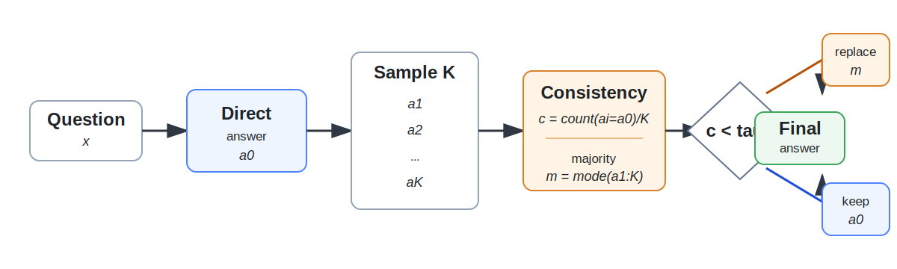

# Consistency-Gated Self-Correction

[](https://github.com/QZF-888/consistency-gated-self-correction/actions/workflows/ci.yml)

**Consistency-Gated Self-Correction** is a lightweight inference-time method for improving reasoning reliability in large language models. The model first gives a direct answer, then samples additional answers. We measure whether those samples support the direct answer; only low-consistency cases are revised by the sampled majority answer.

> Bilingual documentation: [中文 README](README.zh-CN.md)

## Method

For a direct answer \(a_0\) and \(K\) sampled answers \(a_1,\ldots,a_K\), we define the direct-answer consistency:

\[
c = \frac{\operatorname{count}(a_i = a_0)}{K}.
\]

The final answer is:

\[
\hat{a} =
\begin{cases}
\operatorname{mode}(a_{1:K}), & c < \tau,\\
a_0, & c \ge \tau.
\end{cases}
\]

The main experiments use **K = 5** and a fixed threshold **tau = 0.4**. A post-hoc **K = 3** setting is obtained from the first three of the five sampled answers.



## Main Results

The repository contains experiments across five instruction-tuned models and three reasoning benchmarks:

- Models: Qwen2.5-7B, InternLM3-8B, Llama3.1-8B, Mistral-7B-v0.3, Gemma2-9B
- Datasets: GSM8K, ARC-Challenge, GPQA-Diamond

At the fixed threshold \( \tau = 0.4 \), Gated K=5 improves the overall average accuracy from **62.8%** to **65.2%**.

| Dataset | Models | Direct | Standard SC | Gated K=5 | Gain | Trigger rate |
|---|---:|---:|---:|---:|---:|---:|
| GSM8K | 5 | 74.8 | 70.2 | 77.8 | +3.0 | 14.5 |
| ARC-Challenge | 5 | 86.0 | 80.4 | 87.5 | +1.6 | 3.7 |
| GPQA-Diamond | 5 | 27.6 | 27.0 | 30.3 | +2.7 | 30.4 |
| Overall | 15 | 62.8 | 59.2 | 65.2 | +2.4 | 16.2 |


## Repository Layout

```text
configs/        Model, dataset, and experiment matrix configuration
src/cgsc/       Core implementation: extraction, prompts, consistency, evaluation
scripts/        Experiment runners and analysis scripts
kaggle/         Foreground Kaggle cell and usage notes
results/        Released summary CSV/JSON files for tables and analysis
paper/          Figures and LaTeX source used for the paper draft
docs/           Method, reproducibility, and result notes
tests/          Lightweight unit tests
```

## What Is Included

- Reusable Python package under `src/cgsc/`.
- Config files for the model, dataset, and experiment matrix.
- Scripts for running experiments, rebuilding result tables, and regenerating figures.
- Released summary results in CSV/JSON format.
- Paper-ready figures in SVG format, with PNG/PDF copies kept in the local release bundle.
- AAAI-style LaTeX draft sources and references.
- Kaggle foreground-running helper for long model evaluations.
- Lightweight unit tests and a GitHub Actions CI workflow.

## Quick Start

Install:

```bash
pip install -e ".[dev]"
pip install -r requirements.txt
```

Run one model/dataset pair:

```bash
python scripts/run_experiment.py \
  --model internlm3_8b \
  --dataset gsm8k \
  --output-dir runs
```

Print the full experiment matrix:

```bash
python scripts/run_all_matrix.py
```

Run the analysis scripts from existing released outputs:

```bash
python scripts/build_released_tables.py
python scripts/make_release_figures.py
```

Run tests:

```bash
pytest -q
```

## Released Result Files

- `results/summary/main_tau04.csv`: fixed-threshold main table
- `results/summary/best_k5.csv`: best-threshold K=5 ablation
- `results/summary/k3_posthoc.csv`: post-hoc K=3 analysis
- `results/p0/p0_method_ci.csv`: confidence intervals and paired statistics
- `results/p1/p1_consistency_bins_aggregate.csv`: consistency-bin analysis
- `results/p1/p1_transition_cases_tau04.csv`: C-to-W and W-to-C case-level evidence

## Reproducibility Notes

- GPQA answer choices are shuffled with seed 42.
- The fixed policy uses strict comparison: revise when `consistency < tau`, not `<=`.
- K=3 is post-hoc from the first three K=5 samples, so it does not require rerunning the models.
- Some Hugging Face models require access approval and an `HF_TOKEN`.
- Raw per-example model generations are not committed by default. The repository keeps compact released summaries and scripts for reproducing the runs.

## Citation

If you use this code or the released results, please cite the accompanying paper draft or this repository.
