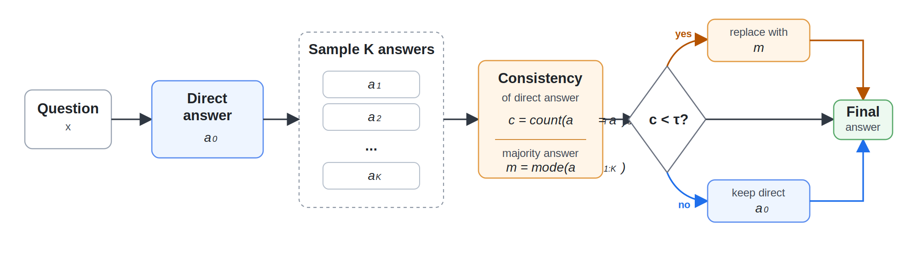

# 基于一致性门控的自我修正

[](https://github.com/QZF-888/consistency-gated-self-correction/actions/workflows/ci.yml)

**Consistency-Gated Self-Correction** 是一个轻量级推理阶段方法，用来提升大语言模型在推理任务上的可靠性。模型先给出一个直接答案，然后额外采样若干个答案。我们不让模型无条件自我修正，而是先检查采样答案是否支持直接答案；只有在一致性较低时，才用采样多数答案替换直接答案。

英文首页见：[README.md](README.md)

## 方法

给定直接答案 $a_0$ 和 $K$ 个采样答案 $a_1,\ldots,a_K$，定义直接答案一致性：

$$
c = \frac{\mathrm{count}(a_i = a_0)}{K}.
$$

最终答案为：

$$
\hat{a} =
\begin{cases}
\mathrm{mode}(a_{1:K}), & c < \tau,\\
a_0, & c \ge \tau.
\end{cases}
$$

主实验使用 **$K = 5$**、固定阈值 **$\tau = 0.4$**。**$K = 3$** 是从五次采样中的前三次做 post-hoc 分析得到的，不需要重新跑模型。



## 主要结果

项目覆盖五个指令模型和三个推理数据集：

- 模型：Qwen2.5-7B、InternLM3-8B、Llama3.1-8B、Mistral-7B-v0.3、Gemma2-9B
- 数据集：GSM8K、ARC-Challenge、GPQA-Diamond

在固定阈值 $\tau = 0.4$ 下，Gated $K=5$ 将总体平均准确率从 **62.8%** 提升到 **65.2%**。

| 数据集 | 模型数 | Direct | Standard SC | Gated K=5 | 提升 | 触发率 |
|---|---:|---:|---:|---:|---:|---:|
| GSM8K | 5 | 74.8 | 70.2 | 77.8 | +3.0 | 14.5 |
| ARC-Challenge | 5 | 86.0 | 80.4 | 87.5 | +1.6 | 3.7 |
| GPQA-Diamond | 5 | 27.6 | 27.0 | 30.3 | +2.7 | 30.4 |
| Overall | 15 | 62.8 | 59.2 | 65.2 | +2.4 | 16.2 |

## 仓库结构

```text
configs/        模型、数据集、实验矩阵配置
src/cgsc/       核心实现：答案抽取、prompt、一致性、评估逻辑
scripts/        实验运行脚本和分析脚本
kaggle/         Kaggle 前台运行 cell 和说明
results/        已整理的结果 CSV/JSON
paper/          论文图和 LaTeX 源文件
docs/           方法、复现和结果说明
tests/          轻量单元测试
```

## 已包含资源

- `src/cgsc/` 下的可复用 Python 包。
- 模型、数据集和实验矩阵配置文件。
- 实验运行、结果表重建和论文图重建脚本。
- 已整理的 CSV/JSON 结果摘要。
- GitHub 可直接展示的方法流程图 SVG。
- AAAI 风格 LaTeX 草稿源码和参考文献。
- 适合 Kaggle 长时间评测的前台运行辅助脚本。
- 轻量单元测试和 GitHub Actions CI 配置。

## 快速开始

安装：

```bash
pip install -e ".[dev]"
pip install -r requirements.txt
```

运行一个模型/数据集组合：

```bash
python scripts/run_experiment.py \
  --model internlm3_8b \
  --dataset gsm8k \
  --output-dir runs
```

打印完整实验矩阵：

```bash
python scripts/run_all_matrix.py
```

基于已有结果重新生成分析：

```bash
python scripts/build_released_tables.py
python scripts/make_release_figures.py
```

运行测试：

```bash
pytest -q
```

## 结果文件

- `results/summary/main_tau04.csv`：固定阈值主表
- `results/summary/best_k5.csv`：K=5 最佳阈值消融
- `results/summary/k3_posthoc.csv`：K=3 post-hoc 分析
- `results/p0/p0_method_ci.csv`：置信区间和配对统计检验
- `results/p1/p1_consistency_bins_aggregate.csv`：一致性分桶分析
- `results/p1/p1_transition_cases_tau04.csv`：C-to-W / W-to-C 案例级证据

## 复现说明

- GPQA 选项用 seed 42 打乱。
- 固定门控规则使用严格小于：`consistency < tau`，不是 `<=`。
- K=3 来自 K=5 五次采样的前三次。
- 部分 Hugging Face 模型需要申请权限并设置 `HF_TOKEN`。
- 原始逐样本生成结果默认不提交到仓库。仓库保留轻量结果摘要和可复现实验脚本。
